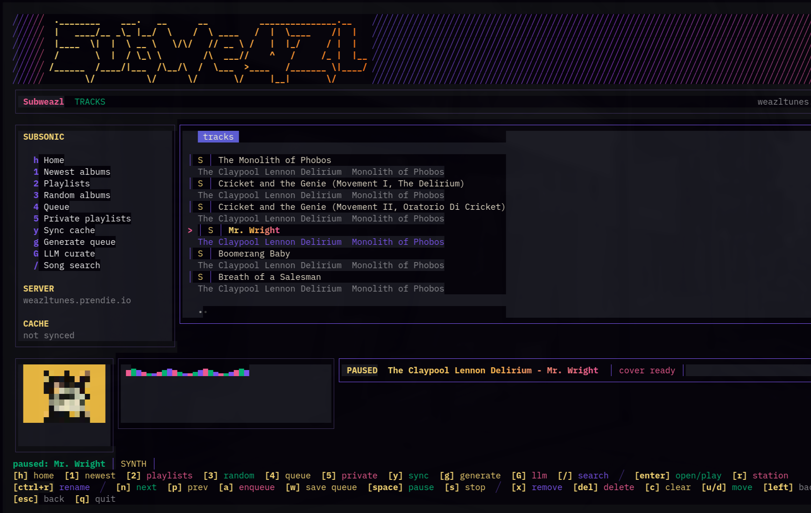

# Subweazl

```text
 .________    ___.   __      __           _______________.__   
 |    ____/__ _\_ |__/  \    /  \ ____   /  |  \____    /|  |  
 |____  \|  |  \ __ \   \/\/   // __ \ /   |  |_/     / |  |  
 /       \  |  / \_\ \        /\  ___//    ^   /     /_ |  |__
/______  /____/|___  /\__/\  /  \___  >____   /_______ \|____/
       \/          \/      \/       \/     |__|       \/
SIGNAL // ENCRYPTED VAULTS // BARE METAL
```

Cloud sync is just telemetry disguised as convenience. Letting a corporation host your playlists means letting them log your vibe, track your hours, and memory-hole your curated tracks whenever licensing rights shift.

Subweazl is the exploit. It’s a sovereign, terminal-native Subsonic client built for the daily path. Connect to your server, unlock your vault, and jump straight into the music. It jacks into the Subsonic API for the raw FLACs, but your curation stays strictly on the bare metal.

There is no local-folder mode. We pull the audio from the server and keep the state in the vault. Play history, queue snapshots, private playlists, cached metadata, and deterministic recipes are locked under paranoid local encryption.

Cover art renders right in the grid. `mpv` does the heavy lifting. `ffmpeg` feeds the live Harmonica VU meters.

No cloud sync. No telemetry. Just your music, locked down tight.



## Own The Whole Weazl Stack

* Browse albums, tracks, and playlists from your own Subsonic-compatible server.
* Stream through `mpv`; pause, skip, reorder, shuffle, repeat, and save queues
  without handing an engagement machine the aux cord.
* Render pixel-art covers and a live `ffmpeg` visualizer directly in the TUI.
* Encrypt history, queue snapshots, cached metadata, private playlists,
  deterministic recipes, and DJ-Weazl curator runs in the local vault.
* Put the current Omarchy agent to work against music you actually own, with
  Ollama and vLLM still available as local alternatives.
* Drive the same player and queue from the Omarchy bar, hardware media keys, or
  the private remote bridge.

## Forge The Binary

You need Go 1.25+, `mpv`, `ffmpeg`, and a C compiler for the SQLite vault. The Omarchy widget also uses `tmux` and `jq`. If you don't have them, shave the yak.

**Linux / macOS:**

```sh
SUBWEAZL_SKIP_LAUNCH=1 SUBWEAZL_SKIP_LLM_SETUP=1 ./scripts/install.sh
```

On Omarchy, the same installer validates and enables the native bar widget,
wires media keys, and keeps the listening process in a detachable tmux session.
Use `--no-widget` (or `SUBWEAZL_SKIP_WIDGET=1`) when you only want the core app.
The integration installs entirely in user-owned paths; `/usr/share/omarchy/`
stays untouched.

The equivalent command-line switches are `--no-launch`, `--no-llm-setup`, and
`--no-widget`. A normal `./scripts/install.sh` performs the full install and
launches the Weazl. The widget is an unsandboxed local plugin: it invokes the
Subweazl binary, `tmux`, `jq`, `hyprctl`, and `omarchy-launch-tui`, but never
needs root or writes outside your user-owned config, state, cache, and install
paths.

Omarchy shell plugins hot-reload. If the deck ever gets stuck on an old build,
bounce it cleanly:

```sh
omarchy restart shell
```

**Windows (MSYS2 required for C compiler):**

```powershell
powershell -ExecutionPolicy Bypass -File .\scripts\install.ps1 -SkipLaunch
```

No wizards. No corporate installers. The script compiles the Go binary, drops it into your path, and gets out of the way.

Want to run it raw?

```sh
go run ./cmd/subweazl
```

## Boot Sequence & The Vault

```sh
subweazl
```

First boot is staged. You punch in your Navidrome/Subsonic server coordinates, test the connection, and then Subweazl locks the door. You set a bcrypt vault password. The SQLite database is choked down to `0600` permissions.

Your Subsonic credentials drop into `~/.config/subweazl/config.json`. The encrypted vault lives under your data directory as `vault.sqlite3`. Forget the password, and you lose your mixtapes. Back up your metal.

Want to script the connection? Environment variables override the config file entirely:

```sh
export SUBWEAZL_SERVER="<server-url>"
export SUBWEAZL_USER="<username>"
export SUBWEAZL_PASSWORD="<password>"
```

## Tactical AI (The Curator)

AI is a weapon, not a default. Subweazl does not arm a provider until you explicitly choose one.

Jack in your local provider:

```sh
subweazl --configure-llm
```

Choose `omarchy` to put your current Omarchy default agent behind DJ-Weazl. The
agent is resolved again for every run, so switching the desktop default changes
the next crate without rewriting Subweazl config. Codex is the supported
agent-backed runner today. Ollama and vLLM keep their local endpoint and model
setup. Blanking the provider disables AI entirely.

Already inside the BBS? Hit `ctrl+l` and choose `omarchy`, `ollama`, or `vllm`.
Omarchy needs no URL or model screen. For the local HTTP providers, punch in the
URL and wait while Subweazl interrogates the endpoint for its models. Uppercase
`L` remains wired as the compatibility alias.

**The Sandbox:** The curator only receives vaulted cache candidates and summary context. It must return cached track IDs. Subweazl validates every returned ID before building the queue. If the model hallucinates an invented or unknown ID, we reject it. Run metadata is stored encrypted in the vault. Zero algorithmic sludge.

`G` opens the AI crate selector. `zero_tax_grindage` builds a 40-track private discovery mix. `Tell Weazl what you want` takes a plain-language order like `rock like Oasis`, grounds it against the actual synced library, and refuses ghost inventory. A real authoritative seed and two launch tracks hit the private playlist first, the queue gets hot immediately, and the remaining 37 cuts stream in behind playback while DJ-Weazl finishes judging the bin.

`M` is the flow-state interrupt. Fire it while a track is running and Mood overwrites the server-side `Mood` playlist with 20 validated, momentum-safe cuts built around that recording. The current track never restarts. The queue keeps breathing while inference, validation, and repair grind in the background.

NEW means the albums most recently uploaded to your Navidrome server—not whatever an engagement funnel wants to sell this week. AI Mix keeps the request in command, caps artist and album sprawl, protects the back nine, blacklists bogus spacer tracks, and never admits an ID that is not in the encrypted cache.

## Omarchy Weazl Deck

On Omarchy, Subweazl follows the live desktop palette without dropping its
identity: the banner, DJ-Weazl, vault language, and BBS controls remain intact
while panels, gradients, status colors, inputs, and visualizer colors move with
the selected theme.

The bar widget is a remote deck for the one running Subweazl process. It shows
the current cut, opens playback controls, cycles modes, and launches Subweazl in
the named `subweazl` tmux session. Close the terminal and the interface detaches;
playback, queue state, and the unlocked Weazl vault stay alive. Open Subweazl
from the widget to reattach to that exact session.

`Stop` kills playback only. **Quit and lock Weazl vault** stops playback, closes
the encrypted store, clears the in-memory key, and ends the listening session.

Hardware Play/Pause, Next, and Previous keys prefer the live Subweazl session.
If no Weazl is running, they fall back to Omarchy's selected media source.
`Alt+Play` advances and `Alt+Shift+Play` goes back on keyboards without track
keys.

### The Private Remote Wire

The live TUI owns a private Unix socket and publishes a small atomic playback
snapshot under the XDG state directory. That snapshot contains display state,
not credentials, vault contents, playlists, or DJ-Weazl prompts. The widget and
media-key helper both use this wire, so every controller talks to one player
and one queue.

```sh
subweazl remote status
subweazl remote toggle
subweazl remote previous
subweazl remote next
subweazl remote stop
subweazl remote mode
subweazl remote quit
```

`remote quit` is the sharp switch: it stops playback, locks the Weazl vault,
and ends the persistent tmux session. The other commands leave the listening
session unlocked and breathing.

To remove the app integration while preserving config, vault, cache, queue,
playlists, and history:

```sh
./scripts/uninstall.sh
```

## Hardware Interrupts

Mouse clicks are dead here. The BBS relies on hotkeys.

**The Network & Discovery**

* `h`: Home / jump back in
* `1`: Newest albums
* `2`: Server playlists
* `3`: Random albums
* `4`: The Queue
* `5`: Private vaulted playlists
* `y`: Sync vaulted Subsonic metadata cache
* `g`: Forge a deterministic queue from the vaulted cache
* `G`: Build and immediately play a private AI Mix
* `M`: Extend the current track into the server-side Mood playlist without interrupting playback
* `ctrl+l`: Configure the optional LLM curator (`L` remains an alias)
* `/`: Search cached tracks first, fallback to the server
* `?`: Open the full keybinding help panel

**Navigation & Execution**

* `enter`: Crack open an album, fire a track, jump to a queue row, or load a private playlist
* `tab` / `shift+tab`: Jack focus between the sidebar and the active pane
* `left`: Eject to the previous section
* `esc`: Kill the search prompt
* `q` / `ctrl+c`: Kill the app entirely

**The Amp & Queue Desk**

* `space`: Pause/resume the audio
* `s`: Kill the playback process
* `n` / `p`: Next/previous track in the queue
* `m`: Cycle playback mode: off, shuffle, shuffle/repeat, repeat
* `a`: Enqueue the selected or active track
* `w`: Forge the current queue into a private vaulted playlist
* `x`: Nuke the selected queue row
* `delete`: Delete the selected server or private playlist after `Y/N` confirmation
* `c`: Clear the queue entirely
* `u` / `d`: Move the selected queue row up/down
* `r`: Forge a saved server station playlist from the active track
* `ctrl+r`: Rename the selected server playlist, current station, or private playlist

Shuffle uses a full Fisher–Yates pass—the old iPod deal. No recommendation-engine thumb on the scale. When an active playlist or queue is open, the selection gradient follows the playing row through next and previous transitions without hijacking a different playlist you are browsing.

**The Playlist Airlock**

* `v`: Copy a selected server playlist into the encrypted vault, or a vaulted playlist back to Navidrome
* `delete`: Arm deletion for the selected server or private playlist
* `Y`: Confirm the exact named target and burn it
* `N` / `esc`: Drop the detonator; nothing changes

Copies replace a case-insensitive same-named destination and never mutate the source. AI Mixes stay private until you explicitly send them across the airlock. Playlist deletion never touches the playing process or active queue.

**The Setup Deck**

* `tab`: Cycle input fields
* `enter`: Test and save the connection
* `ctrl+s`: Force save the connection payload

## The Vaulted State

The local vault is not just a database; it is the entire memory of your session.

* Home restores useful private state the second you unlock.
* Play history stays private and never hits the server.
* Queue snapshots survive a hard restart.
* Private playlists stay local—they do not mutate your Subsonic server.
* Cache sync is manual and encrypted, explicitly used for high-speed local searches and local curation.
* The remote snapshot exposes playback display data only; the private material
  never leaves the vault.

Weaz the juice.
